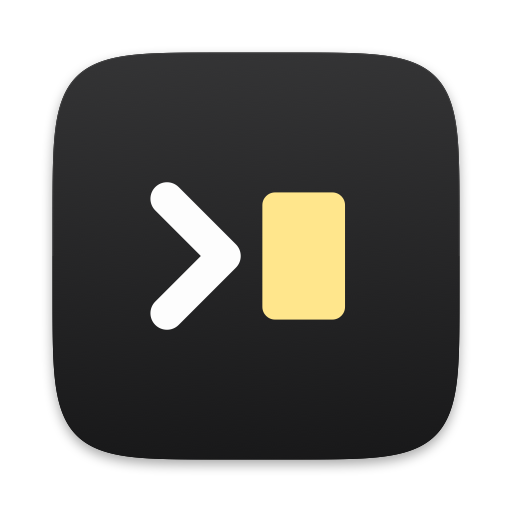
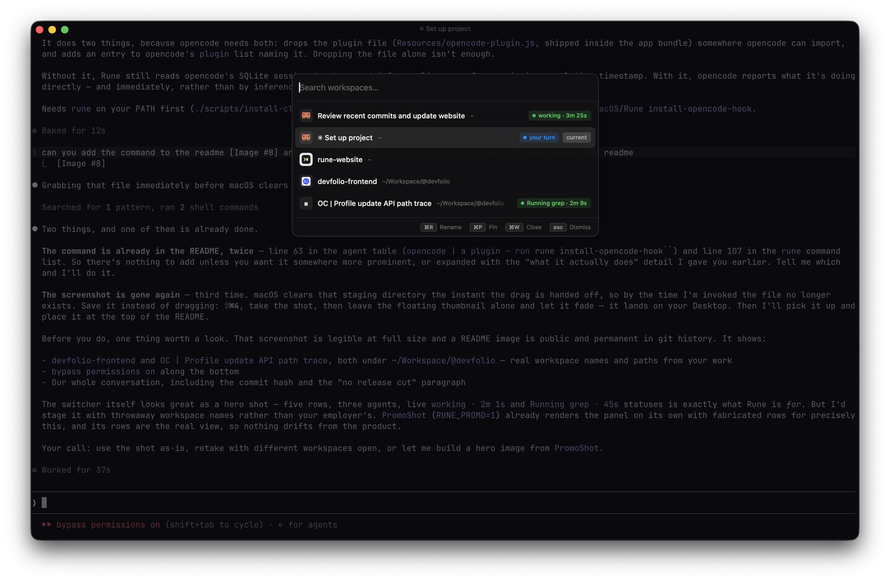

<div align="center">



# Rune

**The terminal for humans who run agents.**

Four agents running, four terminals that look identical. Rune keeps them apart
and tells you which one is waiting on you.



</div>

Built on [libghostty](https://github.com/ghostty-org/ghostty), which does the
hard part — VT parsing, pty, font shaping, Metal rendering. Rune is the shell
around it: workspaces, tabs, splits, and a switcher that says what each terminal
is doing.

macOS 13+ · Apple Silicon and Intel · [rune.sushant.tech](https://rune.sushant.tech) · [latest release](https://github.com/Sushants-Git/Rune/releases/latest)

---

## Install

Download the disk image from
[Releases](https://github.com/Sushants-Git/Rune/releases/latest) and drag Rune
into `/Applications`.

Rune is signed ad-hoc rather than with a paid Developer ID, so macOS quarantines
the download and calls it damaged. It isn't. Clear the flag once:

```sh
xattr -dr com.apple.quarantine /Applications/Rune.app
```

Or open it, dismiss the warning, and use **System Settings → Privacy & Security
→ Open Anyway**.

After that Rune updates itself — on launch, hourly, and from `Check for
Updates…`.

## What it does

**Three places to put a terminal**, so no list grows past reading it. Largest
first, which is the order you reach for them in:

- `⌘N` — **Workspaces**, whole sets of tabs, reachable only from `⌘K`
- `⌘T` — **Tabs**, a strip *inside* the title bar, costing no vertical space
- `⌘D` `⌘⇧D` — **Splits**, panes side by side in one tab

**`⌘K` is the switcher**, and the reason the rest of it holds together. Every
row is a workspace, and everything you do to one is a chord away:

- `↑` `↓` — move through the list, previewing each workspace behind the panel
- `⏎` — keep the one you landed on
- `⎋` — put back whatever you were looking at
- `⌘R` — rename a row, in place
- `⌘P` — pin it to the top, and pinned rows stay in the order you pinned them
- `⌘W` — close it, and every tab and split in it
- `⌘1`–`⌘9` — jump straight to a row by position, without opening `⌘K` at all

**Every row says what its agent is doing.** `working` counts up while it runs,
`your turn` means it stopped — at its prompt or on a question, which for triage
is the same instruction. Read from what each agent publishes about itself, never
from scraping the screen:

| Agent | Where its state is read from |
| --- | --- |
| Claude Code | `~/.claude/sessions/<pid>.json`, keyed by process id |
| Codex | the progress spinner it animates in the terminal title |
| opencode | a plugin — run `rune install-opencode-hook` |

Nothing at all means a plain shell, or an agent Rune can't read: it gets its
icon and no indicator. A guess shown as fact is worse than silence, and there is
no "a command is running" — knowing that needs shell integration, not a guess.

**Rows without an agent still get a face.** vim, tmux, docker, psql, k9s and
twenty more are recognised by their process, and anything unrecognised falls
back to the icon the project itself ships — a favicon, a launcher icon.

Anything with a hook can push its own words onto a row:

```sh
printf '\033]9;Build finished\007'
```

**Drag the panel anywhere it isn't covering what you're reading.** Grab it by
the search strip along its top, the way you would a title bar. Nothing snaps —
it goes exactly where you drop it, and a guide brightens when you've lined up
with one. Where you leave it is where it opens next time.

## Keys

Ordered by how often you reach for it, not by which part of the app it belongs
to. Only what Rune adds — copy, paste and font size behave as they do in every
other terminal.

| Chord | What it does |
| --- | --- |
| `⌘K` | switch workspace |
| `⌘N` | new workspace |
| `⌘W` | close the terminal, or the `⌘K` row |
| `⌘P` | pin a workspace to the top of `⌘K` |
| `⌘1`–`⌘9` | workspace by position |
| `⌘R` | rename a workspace, in place |
| `⌥1`–`⌥9` | tab by position |
| `↑` `↓` | move through `⌘K`, previewing each one |
| `⌘T` | new tab |
| `⌘D` / `⌘⇧D` | split right / down |
| `⌘F` | find in the scrollback |
| `⌘G` / `⌘⇧G` | next / previous match |
| `⌘⌥←↑↓→` | focus the pane that way |
| `⌘⇧[` / `⌘⇧]` | previous / next tab |
| `⌘⇧↵` | zoom a pane, or put it back |
| `⌘⌥=` | equalize splits |
| `⌘⇧N` / `⌘⇧W` | new / close window |

Scrollback, selection, mouse reporting and colours are libghostty, and it reads
the `~/.config/ghostty/config` you already have.

## The `rune` command

```sh
./scripts/install-cli.sh     # symlinks `rune` onto your PATH
```

```
rune                       open Rune, or bring it to the front
rune <directory>           open a workspace there
rune update                update in place
rune install-opencode-hook teach opencode to report what it's doing
rune --version
```

`install-opencode-hook` does two things, because opencode needs both: it writes
the plugin to `~/.config/opencode/plugin/rune.js` and names it in the `plugin`
list in `~/.config/opencode/opencode.json`. That file is edited rather than
replaced — your providers and MCP servers stay where they are. Restart any
running opencode session for it to load.

## Build

Needs macOS 13+, Zig 0.16.0 (`brew install zig`) and Xcode.

```sh
git clone https://github.com/Sushants-Git/Rune.git && cd Rune
./scripts/fetch-ghostty.sh      # the pinned ghostty checkout
./scripts/build-libghostty.sh   # GhosttyKit.xcframework (slow, once)
./scripts/bundle.sh             # build/Rune.app
```

If it stops on `cannot execute tool 'metal'`, run
`xcodebuild -downloadComponent MetalToolchain` and go again.

Releases are cut by pushing a tag:

```sh
git tag v0.13.9 && git push origin v0.13.9
```

## More

[**Design notes**](docs/design-notes.md) — why it's built this way, and the
things that cost real debugging time: reading agent state without touching the
render lock, why there's no "a command is running" indicator, the dmg and icon
pipelines, and what the updater has been wrong about.

## Credit

The input handling in `GhosttySurfaceView` and `GhosttyInput` is adapted from
Ghostty's own macOS embedding layer (MIT, Mitchell Hashimoto and Ghostty
contributors). Getting key translation, dead keys and IME composition right is
subtle, and their implementation is the reference.
