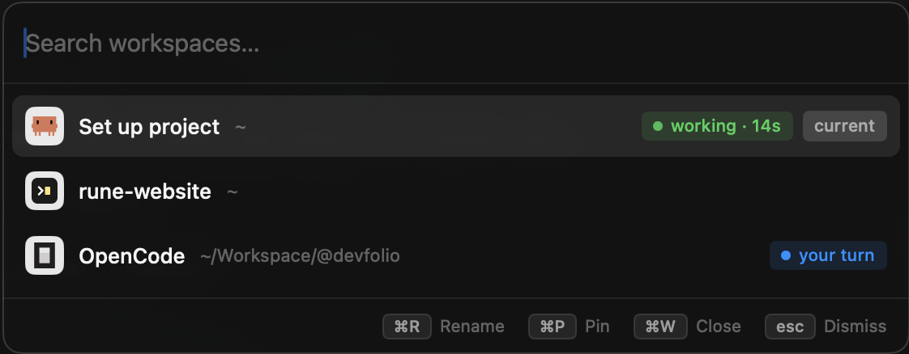

<div align="center">


# Rune

**The terminal for humans who run agents.**

Built on [libghostty](https://github.com/ghostty-org/ghostty) · [rune.sushant.tech](https://rune.sushant.tech) · [latest release](https://github.com/Sushants-Git/Rune/releases/latest)


</div>

---

## Install

macOS 13+, Apple Silicon and Intel. Download the dmg from
[Releases](https://github.com/Sushants-Git/Rune/releases/latest) and drag Rune
into `/Applications`. It's ad-hoc signed, so macOS will call it damaged. It
isn't. Clear the flag once:

```sh
xattr -dr com.apple.quarantine /Applications/Rune.app
```

Or open it and use **System Settings → Privacy & Security → Open Anyway**. It
updates itself after that.

## What it does

<div align="center">

</div>

- `⌘K` opens the switcher.
- `⌘N` makes a new workspace.
- `⌘W` closes the highlighted one, with every tab and split in it.
- `⌘P` pins it to the top. Pinned rows stay in the order you pinned them.
- `⌘R` renames it, in place.
- `⌘1`–`⌘9` jump straight to one without opening the list.

Inside a workspace, `⌘T` adds a tab and `⌘D` / `⌘⇧D` splits the pane right or
down.

Every row says what its agent is doing: `working` with a clock, `your turn` when
it stops, nothing when there's nothing worth saying.

## Keys

Only what Rune adds. Copy, paste and font size work as they do anywhere else.

| Chord | What it does |
| --- | --- |
| `⌘K` | switch workspace |
| `⌘N` | new workspace |
| `⌘W` | close the terminal, or the `⌘K` row |
| `⌘P` | pin a workspace to the top of `⌘K` |
| `⌘1`–`⌘9` | workspace by position |
| `⌘R` | rename a workspace, in place |
| `⌥1`–`⌥9` | tab by position |
| `⌘T` | new tab |
| `⌘D` / `⌘⇧D` | split right / down |
| `⌘F` | find in the scrollback |
| `⌘G` / `⌘⇧G` | next / previous match |
| `⌘⌥←↑↓→` | focus the pane that way |
| `⌘⇧[` / `⌘⇧]` | previous / next tab |
| `⌘⇧↵` | zoom a pane, or put it back |
| `⌘⌥=` | equalize splits |
| `⌘⇧N` / `⌘⇧W` | new / close window |
| `⌘J` | todo list, once you switch it on |
| `⌘E` | uncommitted changes, as a diff |

Rebind any of them in **Settings → Shortcuts**. The todo list is off by default:
turn it on in **Settings → Appearance** and `⌘J` opens a list of what you have
to do in the same panel, as a tree. In the list `a` adds, `o` adds a sub-task,
`⌘R` renames in place as it does in `⌘K`, `c` copies, `d` deletes and `space`
ticks off.

`⌘E` shows what is uncommitted where the focused terminal is standing, in a
panel beside it. Staged, unstaged and untracked files, together.

`⇥` moves between the file list and the diff. In the diff `space` moves the
line under the caret across, or every changed line you select: not staged, it
stages, already staged, it comes back out. `s` does the same for the whole hunk
and `u` is the explicit way back. In the list `space` stages whole files, `v` marks
one viewed and `h` folds its diff away, which sticks until you unfold it, for
the lockfiles and generated things you never want to read. `c` writes the commit
message. `b` hides the file list, `n` and `p` move by hunk, `⌘⇧↵` fills the
window.

Lines already in the index are drawn blue instead of green or red, so a
half-staged file shows you which half at a glance.

It refreshes itself when anything else writes to the repository, so it agrees
with the agent in the pane next to it. It is drawn in your Ghostty font and
`⌘+` sizes both together. Settings ▸ Appearance ▸ Diff picks the palette. Your
`~/.config/ghostty/config` carries over untouched.

## The `rune` command

```sh
./scripts/install-cli.sh     # symlinks `rune` onto your PATH
```

```sh
rune                       # open Rune, or bring it to the front
rune <directory>           # open a workspace there
rune install-opencode-hook # teach opencode to report what it's doing
rune --version
```

`install-opencode-hook` writes `~/.config/opencode/plugin/rune.js` and adds it
to the `plugin` list in `opencode.json`, editing that file rather than replacing
it. Restart any running opencode session to pick it up.

## Build

Needs macOS 13+, Zig 0.16.0 (`brew install zig`) and Xcode.

```sh
git clone https://github.com/Sushants-Git/Rune.git && cd Rune
./scripts/fetch-ghostty.sh      # the pinned ghostty checkout
./scripts/build-libghostty.sh   # GhosttyKit.xcframework (slow, once)
./scripts/bundle.sh             # build/Rune.app
```

If it stops on `cannot execute tool 'metal'`, run
`xcodebuild -downloadComponent MetalToolchain` and try again. Releases are cut
by pushing a tag: `git tag v0.18.0 && git push origin v0.18.0`.

[**Design notes**](docs/design-notes.md) cover why it's built this way, and the
parts that cost real debugging time.

## Credit

Key translation, dead keys and IME composition in `GhosttySurfaceView` and
`GhosttyInput` are adapted from Ghostty's own macOS embedding layer (MIT,
Mitchell Hashimoto and Ghostty contributors), which is the reference for getting
that right. Ghostty's licence ships with Rune: see [NOTICE](NOTICE) and
[licenses/ghostty-MIT.txt](licenses/ghostty-MIT.txt).
